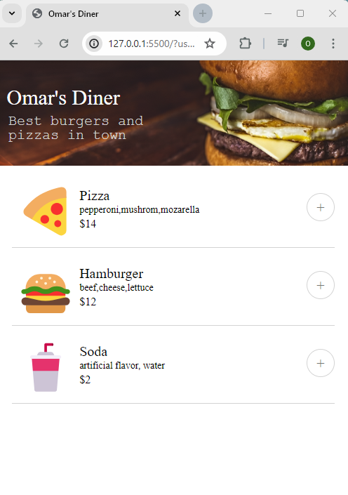

# Resturant Order App

Project is a functioning Resturant order application that has the following functionality. 

- Add items to your order summary when clicked
- Calculate order total and display it
- Remove items when not wanted and adjust order total
- Click complete order to pop up the payment information widget 
- Payment information widget takes info and when pay button is clicked
displays order confirmation with user's name

## Features

- HTML and CSS provide structure and styling for the application.
- JavaScript to take in all DOM interactions and handle only the button interactions.
- JavaScript manipulates the Dom to show order summary, pay widget, and order confirmation. 
- JavaScript renders chanages to screen when items are removed and calculates order total. 